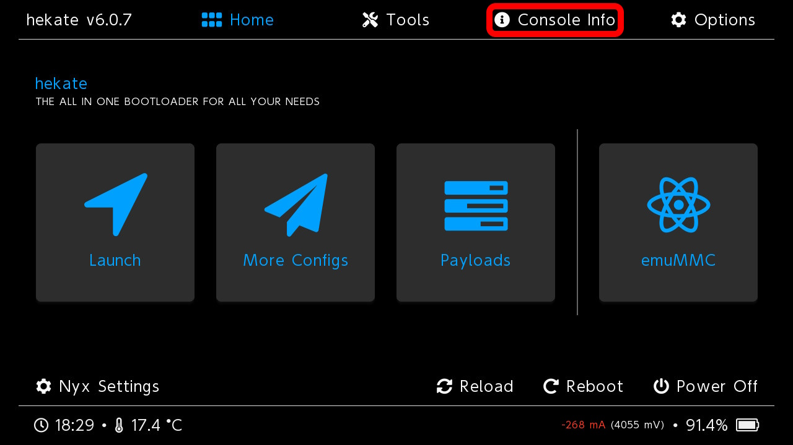
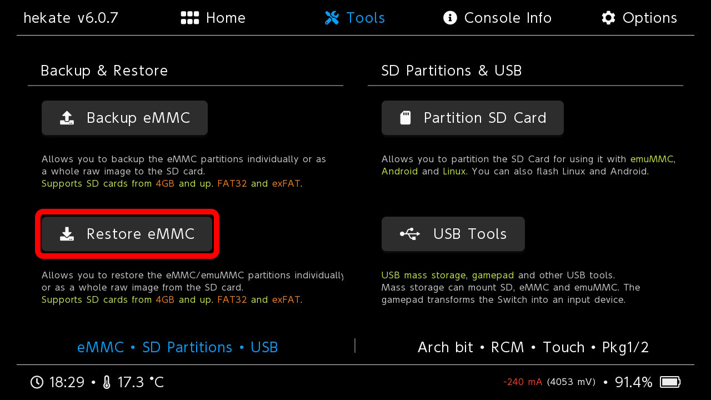
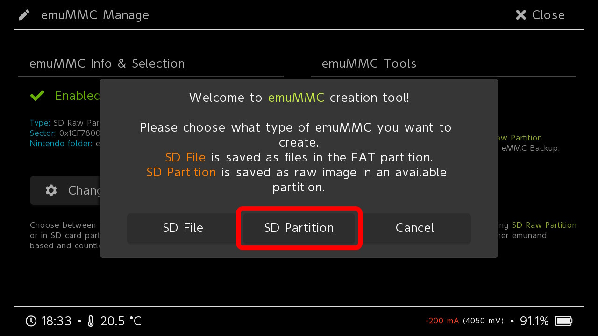
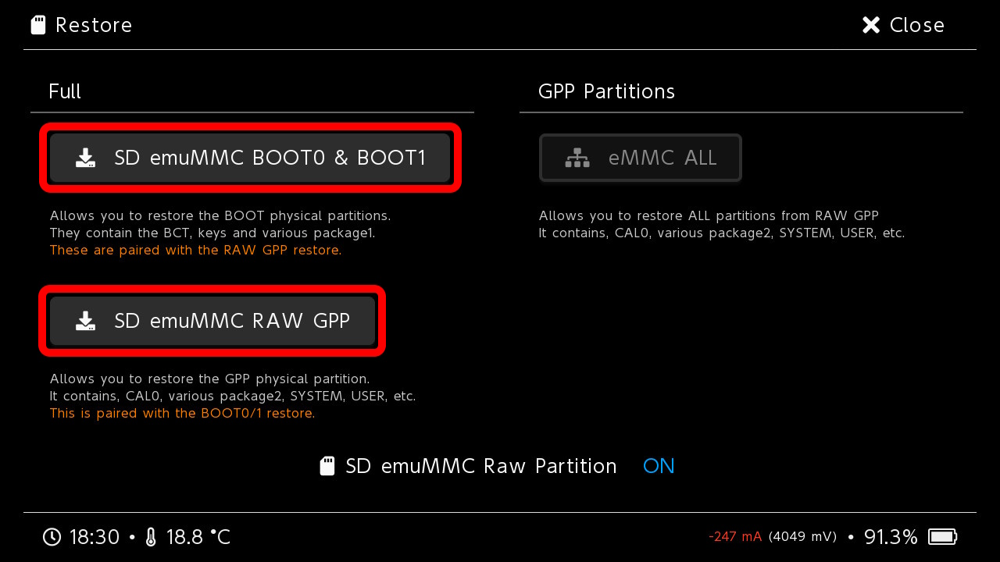

---
hide:
  - navigation
---

# Создание бэкапа и эмунанда
!!! note "Подготовка"
    Для всех последующих действий потребуется наличие Hekate на консоли. 

    1. Если у вас уже стоит Ultra или другая CFW - пропустите 3 и 4 пункты.
    2. Выключите консоль полностью (не в спящий режим).
    3. Выньте карту памяти и вставьте через картридер в пк.
    4. Скачайте последнюю [Ultra](https://github.com/Ultra-NX/Ultra/releases/latest/download/Ultra.zip), и распакуйте архив на карту памяти. Верните карту памяти в консоль.
    5. Включите консоль и на экране с бутлого нажмите Громкость **`–`** для входа в Hekate.

## **Сиснанд (sysnand)**

Это ваша оригинальная система, которая находится в nand памяти.

### **Бэкап Сиснанда**

Обязательно необходим для прошитого свитча. Если мастер вам его не предоставил, или вы сами не делали ранее - **ОБЯЗАТЕЛЬНО** создайте бэкап, он может сэкономить вам очень много времени при возникновении серьезных проблем.

1. Убедитесь, что на карте памяти есть свободное место для бэкапа (v1/v2/lite - 32gb, oled - 64gb).
2. Зайдите в Hekate(нажав кнопку громкости **`-`** при включении консоли).
3. Перейдите на вкладку **Tools**.

4. Заходим в пункт **Backup eMMC**.

5. Делаем бэкапы **BOOT0 & BOOT1** и **RAW GPP** выбрав соответствующие пункты.

6. Бэкап сиснанда готов, не забудьте его перенести с карты памяти по пути `/backup` в безопасное место на компьютере.
   * Eсли вы не ставили игры во внутреннюю память сиснанда - бэкап будет отлично сжиматься при архивации.

### **Бэкап ключей**

Ключи нужны для расшифровки данных на консоли, в основном требуются для некоторых homebrew. Последний уровень восстановления консоли, если вы умудрились все сломать, и потеряли бэкап Сиснанда - все можно будет восстановить благодаря ключам.

1. Зайдите в Hekate(нажав кнопку громкости **`-`** при включении консоли).
2. Перейдите на вкладку **Console Info**.

3. Выбираем пункт **Lockpick**.

4. Консоль загружается в payload LockpickRCM, в нем управляем кнопками Громкость **`+`** и Громкость **`–`**. Выбираем пункт **Dump from SysNAND**.

    

6. После снятия ключей нажатием на **Кнопку Питания** возвращаемся в главное меню, и выбираем **Reboot to hekate**.
7. Бэкап ключей готов, не забудьте скопировать файл **prod.keys** с карты памяти из папки `switch` в безопасное место на компьютере.

### **Восстановление Сиснанда**

1. Выключите консоль полностью (не в спящий режим), и вставьте SD карту через картридер в пк.
2. Поместите вашу папку бэкапа по пути `/backup`. Убедитесь, что файлы BOOT0, BOOT1 и rawnand.bin (Их может быть много) находятся по пути `/backup/"NAND id"/restore/`. В ином случае скопируйте все файлы из папки по пути `/backup/"NAND id"/` в папку `restore`.
3. Зайдите в Hekate(нажав кнопку громкости **`-`** при включении консоли).
4. Перейдите на вкладку **Tools**.

5. Заходим в пункт **Restore eMMC**.

6. Восстанавливаем бэкапы **BOOT0 & BOOT1** и **RAW GPP** выбрав соответствующие пункты.

7. Проверьте работу сиснанда после восстановления.

## **Эмунанд (emunand)**

Копия системы находящаяся на сд карте.
Очень полезный инструмент для того, чтобы обезопасить сиснанд от возможных проблем/бана.
На большинстве прошивок, включая Ультру - Эмунанд настроен на блокировку серверов нинтендо и скрытие серийного номера консоли, так что вне зависимости от действий производимых на Эмунанде, вы не получите бан консоли.

=== "**Создание Эмунанда на разделе**"
    Размер выбирается по желанию, можно сделать маленький Эмунанд внутри которого будут только сохранения от игр, таким образом Эмунанд будет минимально занимать место на карте. Не отображается как занятая память в файловых менеджерах. Более устойчив к повреждениям от высокого разгона.
    **Создание Эмунанда на разделе форматирует карту памяти!**

    1. Убедитесь, что на карте памяти есть свободное место для создания Эмунанда.
    2. Зайдите в Hekate(нажав кнопку громкости **`-`** при включении консоли).
    3. Перейдите на вкладку **Tools**.
    
    4. Заходим в пункт **Partition SD Card**.
    
    5. Ползунком **emuMMC (RAW)** выбираем желаемый размер будущего Эмунанда.
       * Минимульный размер 4гб, с которым вам останется всего ~1.3гб места под сохранения игр, что очень мало. Оптимальный размер 10гб, при котором остается 7гб+ свободного места под сохранения, чего вполне достаточно. Так же можно сделать Эмунанд классического размера (v1/v2/lite - 32gb, oled - 64gb).
    
    6. Продолжаем выбирав пункт **Next Step**.
    
    7. Подтверждаем создание нажав **Start**. Это форматирует вашу карту памяти.
    
    8. После успешного форматирования карты памяти, выходим обратно на главное меню Hekate - на вкладку **Home**, после чего заходим в пункт **emuMMC**.
    
    9. Выбираем пункт **Create emuMMC**.
    
    10. Выбираем пункт **SD Partition**.
    
    11. Выбираем **Part 1**.
    
    12. После окончания нажмите **OK**. Вы создали Эмунанд на разделе.
    13. Не забывайте, что вы отформатировали карту памяти. Если на SD карте общий размер файлов был более 1 Гб, то вам надо заново распаковать ультру на карту памяти с заменой файлов.

=== "**Создание файлового Эмунанда**"
    Равен размеру Сиснанда, что может быть проблемой для Свитч OLED, у которого Сиснанд 64 Гб.
    Так же напрямую занимает место на сд карте, что будет отображаться как занятое место в файловых менеджерах. Немного медленнее Эмунанда на разделе, и менее устойчив к нестабильному разгону консоли, из-за чего выше шанс на поломку Эмунанда.

    1. Убедитесь, что на карте памяти есть свободное место для создания Эмунанда. Требуемое место зависит от размера Сиснанда (v1/v2/lite - 32gb, oled - 64gb).
    2. Зайдите в Hekate(нажав кнопку громкости **`-`** при включении консоли).
    3. Заходим в пункт **emuMMC**.
    
    4. Выбираем пункт **Create emuMMC**.
    
    5. Выбираем пункт **SD File**.
    
    6. После окончания нажмите **OK**. Вы создали Файловый Эмунанд.

### Бэкап Эмунанда
В бэкапе сохраняется информация об установленных играх на момент бэкапа, а так же время проведенное в играх и сохранения. Имеет смысл делать бэкап перед тестами разных вариантов разгона системы, что бы если у вас сломается Эмунанд - вы могли восстановить его из бэкапа не потеряв ничего. В ином случае вам придется создавать Эмунанд заново, устанавливать по новой игры и восстанавливать сохранения, если вы озаботились их бэкапом.

!!! danger "Примечание об играх"
    В бэкапе эмунанда не сохраняются игры установленные на карту памяти, только игры установленные в эмунанд(при условии, что эмунанд стандартного размера).

#### **Бэкап Эмунанда на разделе**

1. Убедитесь, что на карте памяти есть свободное место для бэкапа. Требуемое место зависит от размера Эмунанда, если вы не редактировали размер при создании, то для v1/v2/lite - 32gb, для oled - 64gb.
2. Зайдите в Hekate(нажав кнопку громкости **`-`** при включении консоли).
3. Перейдите на вкладку **Tools**.

4. Заходим в пункт **Backup eMMC**.

5. Переключаем слот бэкапа на эмунанд нажав на пункт **SD emuMMC Raw Partition**.

6. Делаем бэкапы **BOOT0 & BOOT1** и **RAW GPP** выбрав соответствующие пункты.

7. Бэкап эмунанда готов, не забудьте его перенести с карты памяти по пути */backup* в безопасное место на компьютере.

#### **Бэкап файлового Эмунанда**

1. Выключите консоль полностью (не в спящий режим), и вставьте SD карту через картридер в пк.
2. Эмунанд находится по пути `/emuMMC/SD00/eMMC` (вместо SD00 может быть другое название). Скопируйте папку в безопасное место на компьютере. Можно копировать сразу папку **emuMMC**.

**ВНИМАНИЕ!!!** Внутри папки **emuMMC** так же находятся все установленные в эмунанде, на карту памяти игры, так что она может весить очень много.

### Восстановление Эмунанда

#### **Восстановление Эмунанда на разделе**

1. Выключите консоль полностью (не в спящий режим), и вставьте сд карту через картридер в пк.
2. Поместите вашу папку бэкапа по пути `/backup`. Убедитесь, что файлы BOOT0, BOOT1 и rawnand.bin (Их может быть много) находятся по пути `/backup/"NAND id"/restore/emummc/`.
3. Зайдите в Hekate(нажав кнопку громкости **`-`** при включении консоли).
4. Перейдите на вкладку **Tools**.

5. Заходим в пункт **Restore eMMC**.

6. Переключаем слот восстановления на эмунанд нажав на пункт **SD emuMMC Raw Partition**.

7. Восстанавливаем бэкапы **BOOT0 & BOOT1** и **RAW GPP** выбрав соответствующие пункты.

8. Проверьте работу эмунанда после восстановления.

#### **Восстановление файлового Эмунанда**

1. Выключите консоль полностью (не в спящий режим), и вставьте сд карту через картридер в пк.
2. Поместите сохраненный эмунанд по пути `/emuMMC/SD00/eMMC` (вместо SD00 может быть другое название). Если вы сохраняли папку **emuMMC**, то просто скопируйте ее на карту памяти.

## Бэкап сохранений

Ваш прогресс в играх. Они находятся в вашем Профиле, который внутри Сиснанда/Эмунанда, поэтому достать их просто так не получится. В идеале - делать время от времени Бэкап сохранений через DBI и скидывать папку с бэкапами в безопасное место на компьютере, но даже если вы этого не делали и у вас все сломалось, не переживайте, есть способы их достать.

### Создание бэкапа сохранений

1. Заходим в **DBI** > **Сохранения**
2. Мы на вкладке `Установленные`, где находятся сохранения от всех установленных игр
3. Выделяем нужные вам игры, для которых вы хотите сделать Бэкап сохранения на `(X)`, либо выделаем сразу все на `(Y)`, далее `(+)` > `Сделать бекап`, это сделает бэкап сохранений для всех выделенных игр
4. Так же можно выбрать `Сделать бекап, если новее` - это сделает бэкап только для игр, для которых у вас еще нет актуального бэкапа. Если вы поиграли в какую-то игру и это обновило вам сохранение для нее, то этот пункт создаст вам новый бэкап.
5. На кнопку `(R)` можно перейти на вкладку `Удалённые`, и на ней сделать бэкапы сохранений для удалённых игр
6. По умолчанию в Ultra-NX бэкапы сохраняются на сд карте в папку **/DBIsaves**, советую после создания бэкапа - сохранить эту папку в надежном месте на вашем пк
   * Важно! Не забывайте делать бекапы перед обновлением прошивки, или перед настройкой разгона консоли через **Tuner**

### Восстановление бэкапа сохранений
1. Перемещаем папку **DBIsaves** в корень карты памяти
2. Заходим в **DBI** > **Сохранения**
3. Переходим на вкладку бэкапы
4. Выделяем нужные вам игры, для которых вы хотите восстановить Бэкап сохранения на `(X)`, либо выделаем сразу все на `(Y)`, далее `(+)` > `Восстановить для...` и выбираем пользователя для которого хотим восстановить сохранения

[Использование: Особенности и Разгон](usage.md){ .md-button .md-button--primary }