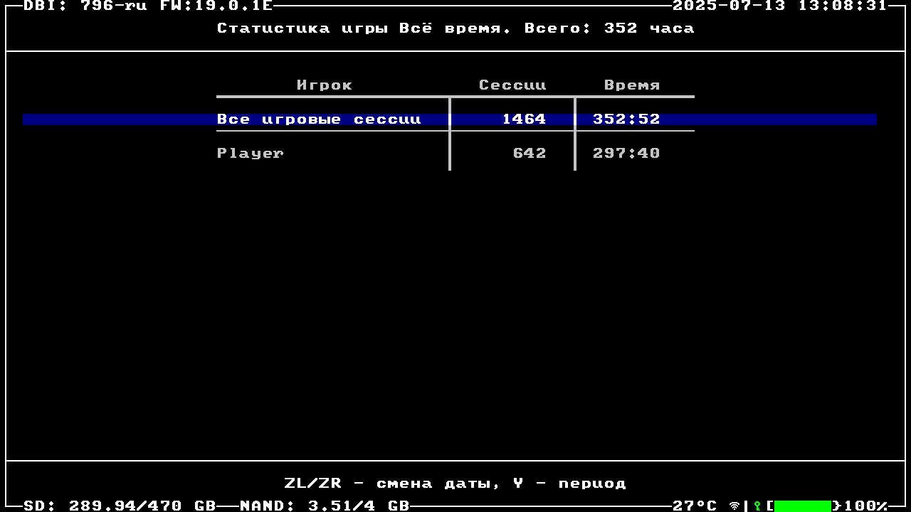
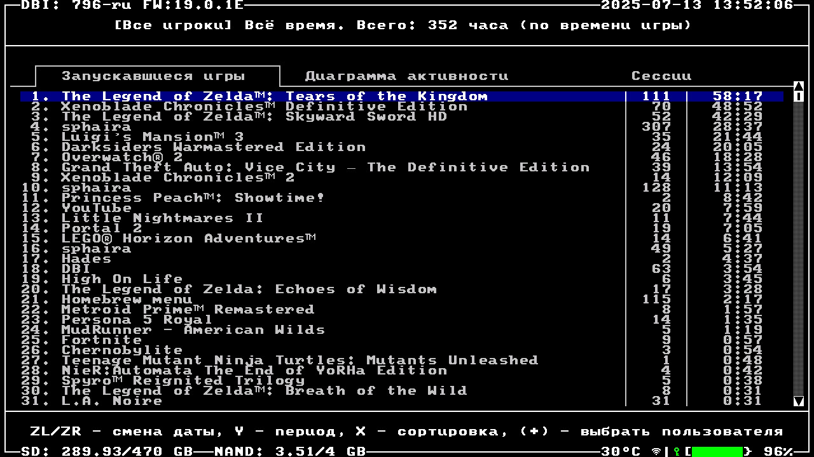
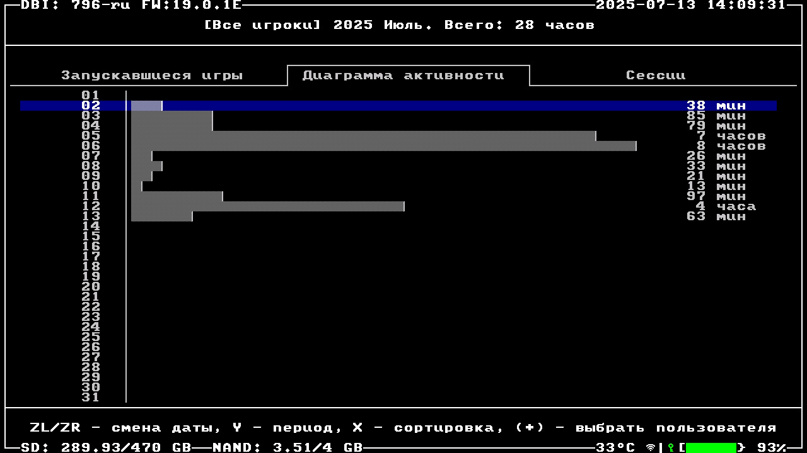
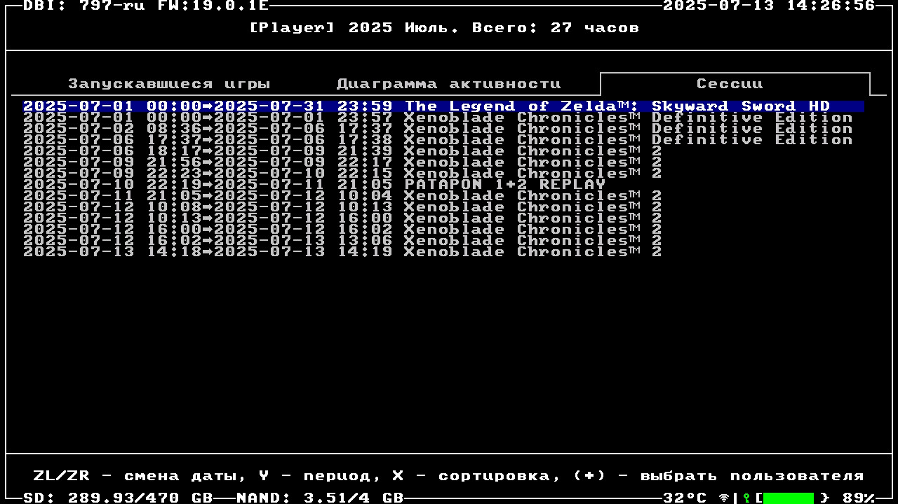

---
hide:
  - navigation
---
# Журнал активности DBI

!!! note "Описание"
    Журнал активности предоставляет детальную статистику игровых сессий, позволяя отслеживать время, проведенное в играх и приложениях и анализировать активность.

- **Выбор профиля**: Статистика может отображаться для конкретного пользователя или для всех профилей системы (опция **Все игровые сессии**). В последнем случае учитывается также активность в Homebrew-приложениях.
- **Период**: Доступны 4 варианта:
    - **За день** – статистика за текущие сутки.
    - **За месяц** – данные за выбранный месяц.
    - **За год** – годовая статистика.
    - **За всё время** – полная история активности на консоли.
- **Управление**: 
    - `(Y)` – переключение между периодами.
    - `(ZL)`/`(ZR)` – точная настройка даты (день/месяц/год в зависимости от выбранного периода)

---

Во вкладке **Запускавшиеся игры** представлен список всех игр с детализацией по времени и количеству сессий:

- **Сортировка** `(X)`:
    - **По времени игры** – игры упорядочены по общему времени, проведенному в них.
    - **По числу запусков** – сортировка по количеству игровых сессий.
    - **По названию** – алфавитный порядок.

Выбор игры позволяет отобразить подробную статистику активности в виде диаграммы.

---

Вкладка **Диаграмма активности** отображает общую игровую активность на консоли в виде различных диаграмм.

Диаграммы автоматически адаптируются под выбранный период.

---

Этот раздел отображает все игровые сессии. При выборе сессии есть возможность посмотреть подробную информацию.

- **Информация о сессии**:
    - Дата и время начала/окончания.
    - Продолжительность игры.
    - Время простоя консоли (не учитывается в статистике).