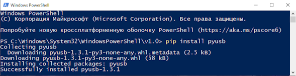

---
hide:
  - navigation
---
# Установка игр через dbibackend

!!! tip "Что это и зачем?"
    Данный метод установки может быть полезен, если у вас есть проблемы при установке по MTP, например, неожиданные прерывания установки в процессе передачи больших по размеру файлов.

## Установка Python, пакета pyusb и драйвера libusbK

!!! note "Примечание"
    Все нижеописанные действия нужно проделать один раз и они необходимы для успешного запуска программы и ее функционирования.

### Установка Python

1. Загрузите  установочный файл Python c [официального сайта](https://www.python.org/downloads/).
2. Запустите установку и в первом окне поставьте галочку для пункта **Add python.exe to PATH**. Затем нажимаем **Install now** и ждем завершения установки, после чего выходим из установщика нажатием **Close**.

### Установка пакета pyusb
1. Запускаем Powershell и вводим команду `pip install pyusb` и ждем завершения установки, затем закрываем.

### Установка драйвера libusbK
1. Скачиваем Zadig с [официального сайта](https://zadig.akeo.ie/) и запускаем.
2. Подключаем консоль по кабелю к ПК, заходим в DBI и нажимаем Y.
3. В окне Zadig определится устройство DBI, необходимо выбрать драйвер `libusbK (v.3.1.0.0)`, затем нажать **Install Driver** и дождаться окончания установки. Если драйвер успешно установлен в DBI появится сообщение **"Ожидается запуск dbibackend..."**

## Установка игр
1. Скачайте [архив с dbibackend](res/dbibackend/dbibackend.zip), распакуйте его и запустите dbibackend.py.
2. В интерфейсе программы есть возможность выбрать путь до папки с игрой(**Add folder**), а также добавление отдельных файлов(**Add files**). Добавьте игры в список установки любым из способов и нажмите **Start server**.

3. Подключите консоль по кабелю к ПК, откройте **DBI** и нажмите `(Y)`. На экране отобразится список файлов которые вы подготовили к установке.

5. Выбираем необходимые нажатием `(X)` , затем нажимаем `(A)`, выбираем место установки и начинаем ее.

