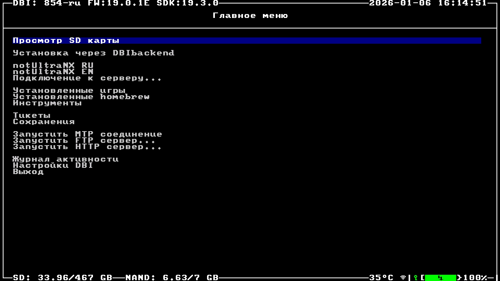
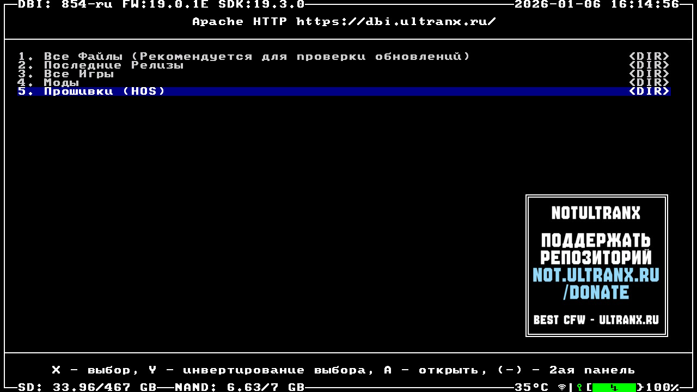

---
hide:
  - navigation
---
# Обновление HOS

!!! question "Что такое HOS?"
     HOS расшифровывается как Horizon Operating System — это операционная система, на базе которой работает консоль Nintendo Switch.

## Обновление HOS

!!! warning "Предупреждение"
    Перед обновлением HOS убедитесь, что установленная версия сборки поддерживает HOS, на которую вы хотите обновиться. Поддерживаемую версию HOS вы можете посмотреть на главной странице [notUltraNX](https://github.com/Ultra-NX/UltraNX).

1. Откройте DBI при помощи **Sphaira**(R+альбом или игра) или ярлыка, если он у вас создан

2. Перейдите в **notUltraNX** и откройте раздел **Прошивки (HOS)**

3. Выберите версию HOS, которая вас интересует

4. Согласитесь на загрузку

5. Подтвердите установку

6. Выберите Reboot

!!! note "Обновление HOS на Сиснанде"
    Если вы хотите обновить HOS на Сиснанде для лицензионных игры, то рекомендуется это делать таким же способом(в четвёртом шаге выбирайте самую новую версию HOS), как в Эмунанде, загрузившись через Semi-Stock. Были сообщения от пользователей с чипами HWFLY, что обновление официальным способом убивает Сиснанд. Если у вас консоль с другим чипом, то всё равно рекомендуется обновиться через Semi-Stock, чтобы избежать возможных проблем.