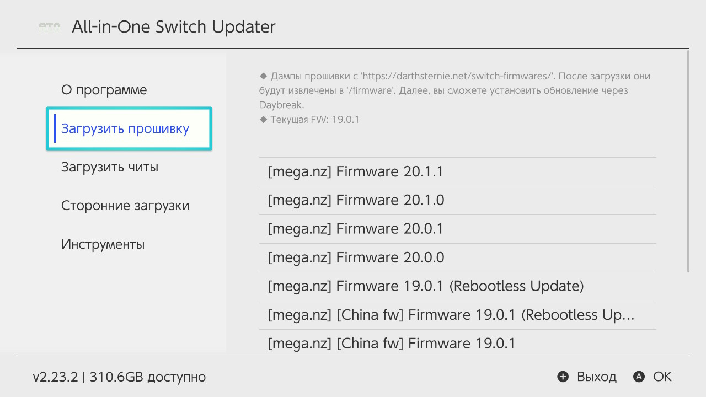
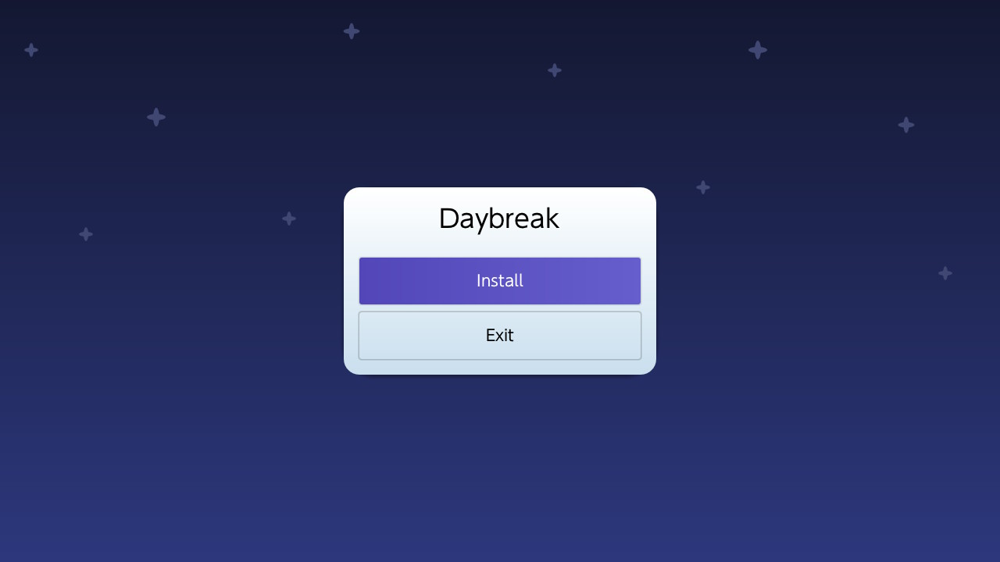
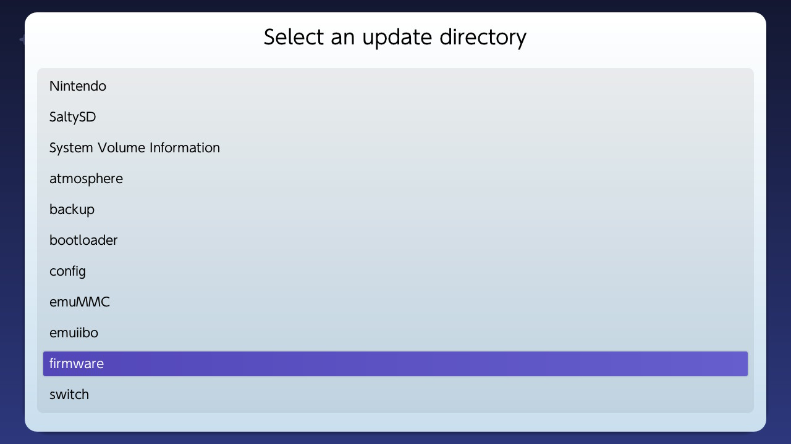
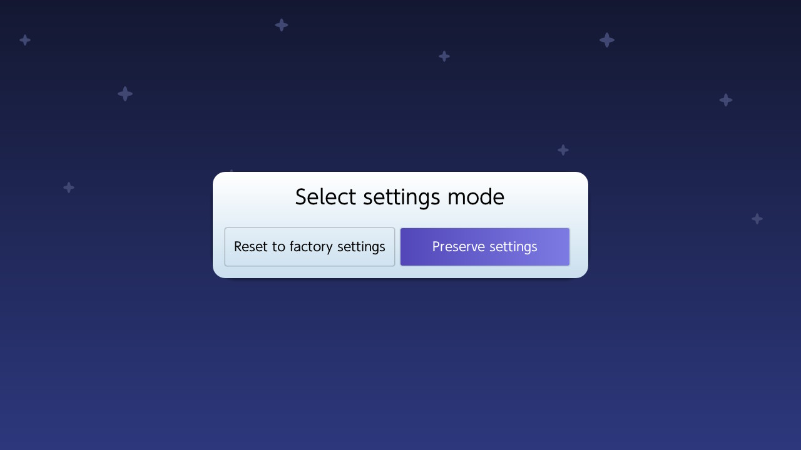
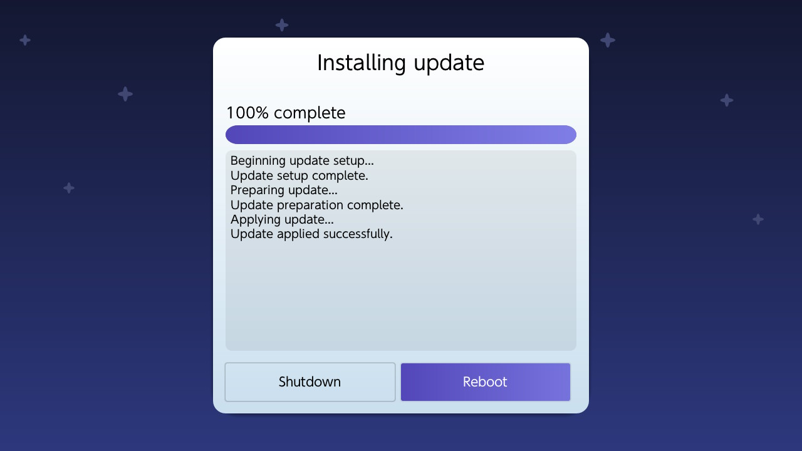
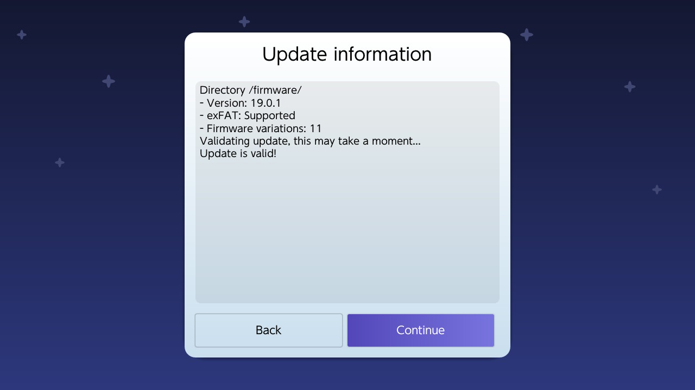
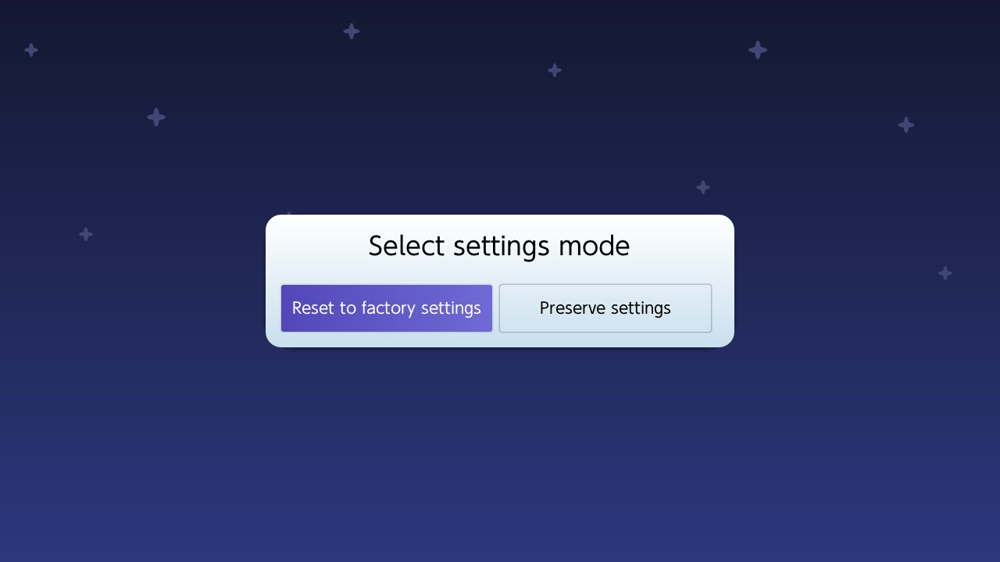
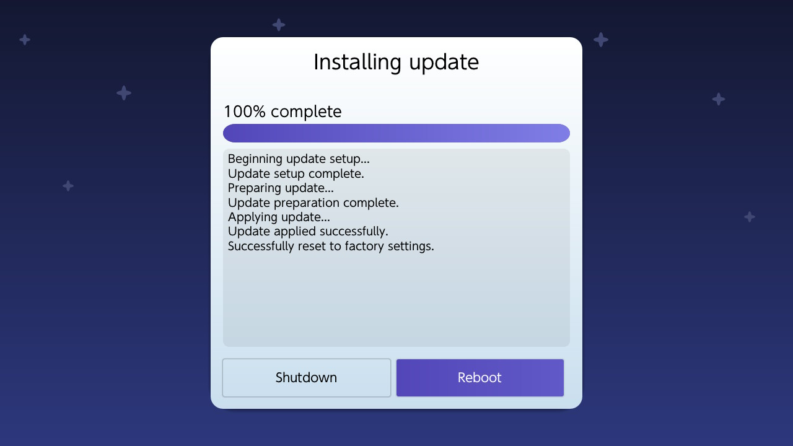

---
hide:
  - navigation
---
# Обновление и откат HOS

!!! question "Что такое HOS?"
     HOS расшифровывается как Horizon Operating System — это операционная система, на базе которой работает консоль Nintendo Switch.

## Обновление HOS

### Загрузка файлов обновления

1. Запустите [**Homebrew menu**] (Зажав R зайти в игру/альбом), затем откройте **All in One Updater**.
2. В разделе **Загрузить прошивку** выберите и загрузите версию прошивки на которую вы будете обновлять консоль. Желательно загружать rebootless версию прошивки, так как она новее(в ней есть изменения, которые не требовали перезагрузки консоли при обновлении).

### Установка обновления

1. Запустите [**Homebrew menu**] (Зажав R зайти в игру/альбом), затем откройте **Daybreak**.
2. Следуйте примеру ниже, выбирая пункты, выделенные синим цветом.

## Откат HOS

!!! warning "Сброс до заводских настроек"
     При откате с 20 HOS необходимо выбрать сброс до заводских настроек в Daybreak, во избежании ошибок после отката. Это приведет к потере всех пользовательских данных. Вы можете предварительно сделать бэкап сохранений в DBI и [бэкап своего профиля в Linkalho](../useful_guides/linkalho_nnid.md), чтобы восстановить их после отката. Все установленные игры к сожалению будут утеряны.

1. Убедитесь что вы используете версию Ultra NX не ниже 2.4|R2x, или [обновите ее через All in One Updater](../ultra_wiki/installing_update.md#obnovlenie-cherez-aio).
2. Загрузите через All in One Updater файлы прошивки, на которую вы будете делать откат.
3. Запустите [**Homebrew menu**] (Зажав R зайти в игру/альбом), затем откройте **Daybreak**.
4. Следуйте примеру ниже, выбирая пункты, выделенные синим цветом.

