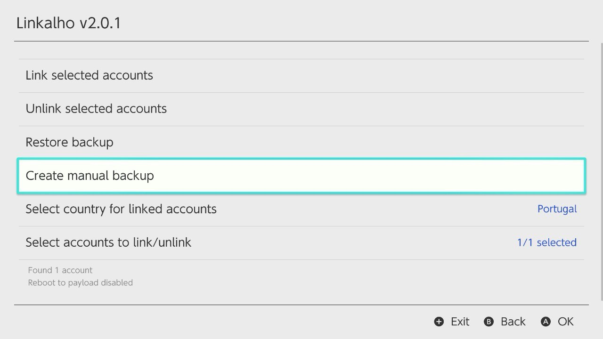
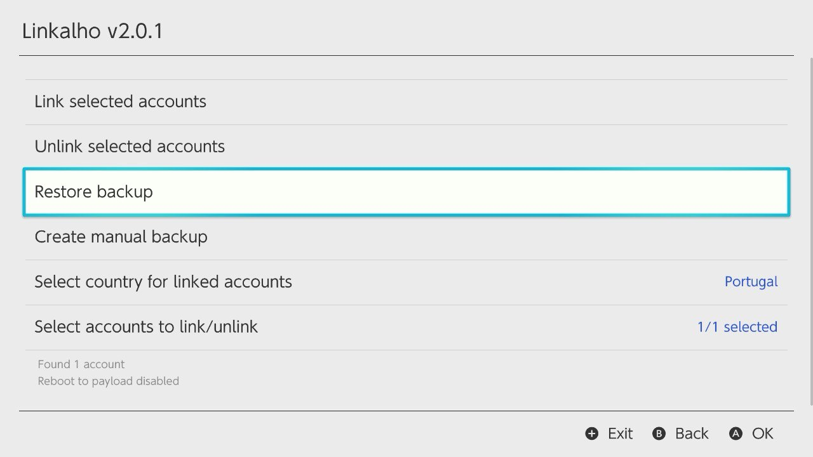
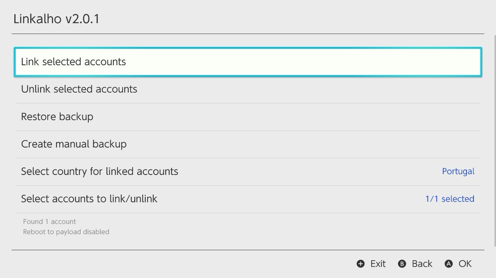

---
hide:
  - navigation
---
# Привязка NNID к аккаунту с помощью Linkalho

## Загрузка Linkalho через UltraTuner

1. Откройте оверлей UltraHand нажатием комбинации **`(L)`+`(R)`+`(▲)`**, после чего нажмите **`(►)`** чтобы попасть в меню пакетов, и выберите **Ultra Tuner**.
2. Заходим в **Software**, далее **Homebrews** и скачиваем **Linkalho**.

!!! note "Ошибка при загрузке"
    Если при загрузке вы видите **X** проверьте настройки интернет-подключения на консоли, а также правильно ли настроена дата и время.

## Создание бэкапа профиля в стоке и восстанвление на эмунанде (рекомендуется)

1. Загрузитесь в **Fullstock** и привяжите свой онлайн-аккаунт Nintendo к профилю. Проверьте что отключена функция облачных сохранений.
2. Загрузитесь в **Semistock** и запустите Linkalho в режиме аплета (запуск через Альбом +  **R**).
3. Выберите пункт **Create manual backup**, затем **Continue**. После того как бэкап был создан нажимаем **Reboot** и загружаемся в эмунанд.

4. Заходим в папку `./switch/linkalho/backup` и переименовываем архив с бэкапом `backup_profiles_********_******_[manual].zip` в `restore.zip`.
5. Перемещаем архив с бэкапом из папки `./switch/linkalho/backup` в папку `./switch/linkalho/restore`
6. Заходим в Linkalho и выбираем **Restore backup**, затем **Continue**. После восстановления бэкапа нажимаем **Reboot**. Процесс переноса завершен.

## Привязка фейкового аккаунта к профилю (не рекомендуется)

!!! note "Примечание"
     Данный способ не рекомендуется, потому что может влиять на общую стабильность работы эмунанда. Тем не менее, если вы испытываете трудности с первым методом, то можете воспользоваться этим.

1. Загрузитесь в эмунанд и запустите Linkalho.
2. Выберите **Link selected accounts**, затем **Continue**. После привязки нажимаем **Reboot**. Процесс привязки завершен.
