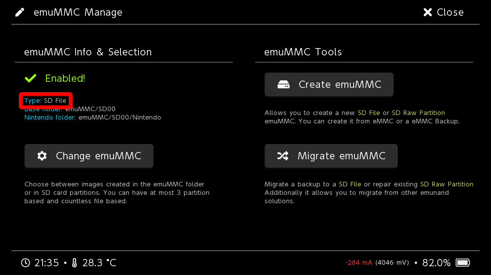
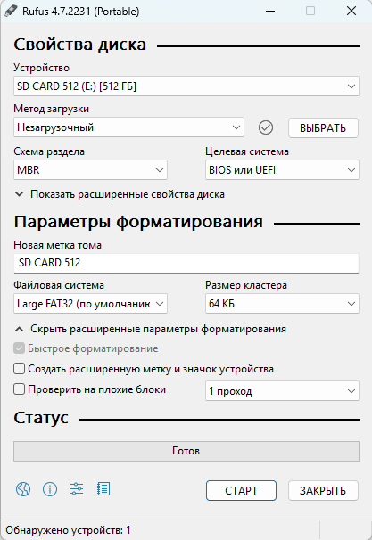
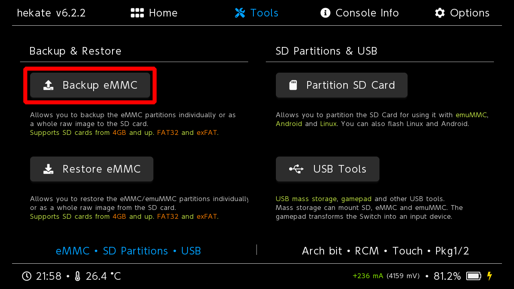
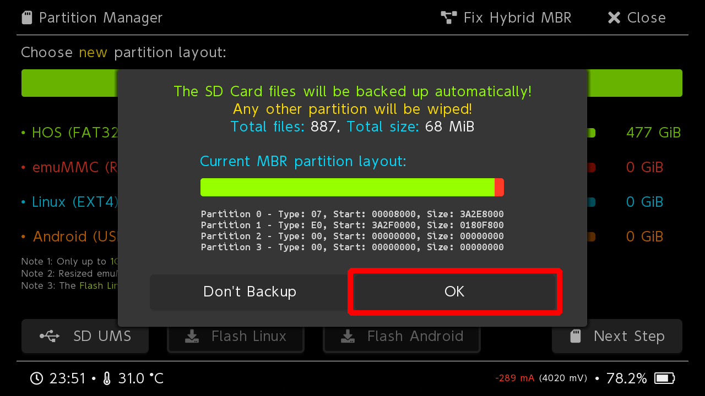
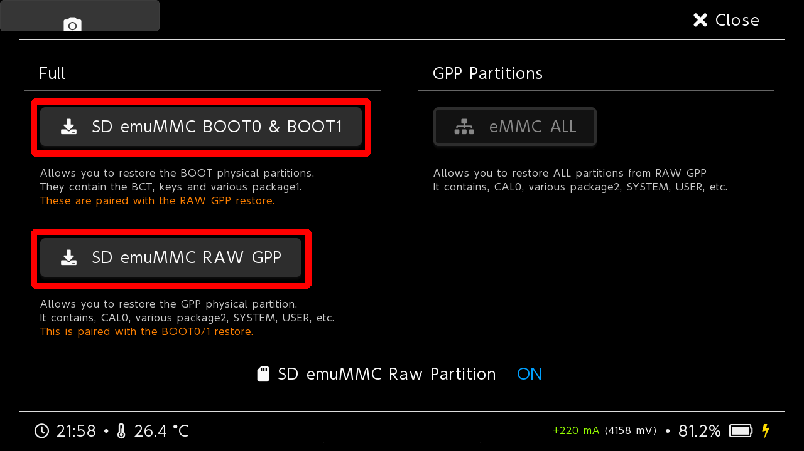

---
hide:
  - navigation
---
# Переход на новую памяти

## Определения типа Эмунанда
Для начала нам надо определить какой у вас тип Эмунанда. Сделать это можно, используя Hekate.

1. Выключите вашу консоль и зайдите в hekate(кнопка уменьшения громкости при включении консоли, если консоль с чипом)

2. Перейдите во вкладку **emuMMC**
3. Обратите внимание на строчку `Type:`
=== "SD File"
    Так выглядит **файловый Эмунанд**
    

=== "SD Raw Partition"
    Так выглядит **Эмунанд на разделе**
    

=== "Disabled"
    Так выглядит **отсутствие эмунанда**
    
    
    !!! danger "Эмунанд"
        У вас отсутствует Эмунанд. Настоятель рекомендуется сделать [очистку системы от следов](sysnand_wipe.md) пиратства и [создать Эмунанд](..ultra_wiki/backup_emuMMC.md#emunand-emunand).

## Переход на другую SD карту

=== "Файловый эмунанд"
    1. Скачайте программу [Rufus](https://rufus.ie/)
    2. Вставьте новую карту памяти в картридер и подключите его в ПК
    3. Откройте **Rufus** и настройки для форматирования SD карты, как на скриншоте
    
    4. Нажмите на кнопку **Старт**
    5. Скопируйте всё содержимое прошлой карты памяти на новую
    
=== "Эмунанд на разделе"
    1. Войдите в **Hekate**(кнопка уменьшения громкости при включении консоли, если консоль с чипом)
     
    2. Перейдите в раздел **Tools**
    
    3. Перейдите в **Backup eMMC**
    
    4. Переключите SD emuMMC RAW Partition на ON
    
    5. Сделайте бэкап Эмунанда выбрав по порядку **SD emuMMC BOOT0 & BOOT1** и **SD emuMMC RAW GPP**
    
    6. Скачайте **[Ultra-Nx](https://github.com/Ultra-NX/UltraNX/releases/latest/download/Ultra.zip)**
    7. Распакуйте архив на **новую** карту памяти
    8. Карта памяти должна выглядеть так
    
    9. Извлеките старую карту памяти из консоли и вставьте новую. Выключать консоль для этого не обязательно — в Hekate предусмотрена функция безопасного извлечения карты памяти. Если вы вышли из Hekate, то войдите в неё снова.
    
    10. Перейдите в раздел **Tools**
    
    11. Перейдите в **Partition SD Card**
    
    12. Нажмите **OK**
    
    13. Потяните ползунок **emuMMC (RAW)** выбрав размер раздела под Эмунанд, как на **прошлой** карте памяти
    14. Нажмите **Next Step** и согласитесь на создание раздела под Эмунанд
    
    15. После завершения создания раздела для Эмунанд извлеките новую карту памяти из консоли
    16. Удалите всё с **новой** карты памяти, после этого перенесите на неё всё со **старой**
    17. На новой карте перейдите в папку `backup/NAND_ID/emummc` переместите все файлы из этой папки в `backup/NAND_ID/restore/emummc`
    18. Вставьте новую карту памяти в консоль
    19. Перейдите в раздел **Tools**
    
    20. Перейдите в **Restore eMMC**
    
    21. Переключите SD emuMMC RAW Partition на ON
    
    22. Восстановите бэкап Эмунанда выбрав по порядку **SD emuMMC BOOT0 & BOOT1** и **SD emuMMC RAW GPP**
    
    !!! note "Папка бэкапа Эмунанда"
        После восстановления бэкапа Эмунанда, вы можете удалить папку backup с новой карты памяти, чтобы она не занимала место
    
=== "Без Эмунанда"
    !!! danger "Эмунанд"
        У вас отсутствует Эмунанд. Настоятель рекомендуется сделать [очистку системы от следов](sysnand_wipe.md) пиратства и [создать Эмунанд](../ultra_wiki/backup_emuMMC.md#emunand-emunand).
    1. Скачайте программу [Rufus](https://rufus.ie/)
    2. Вставьте новую карту памяти в картридер и подключите его в ПК
    3. Откройте **Rufus** и настройки для форматирования SD карты, как на скриншоте
    
    4. Нажмите на кнопку **Старт**
    5. Скопируйте всё содержимое прошлой карты памяти на новую

!!! note "Обновление системы"
    После перехода на новую карту рекомендуется [обновить систему](../ultra_wiki/installing_update.md#obnovlenie-cherez-aio). 