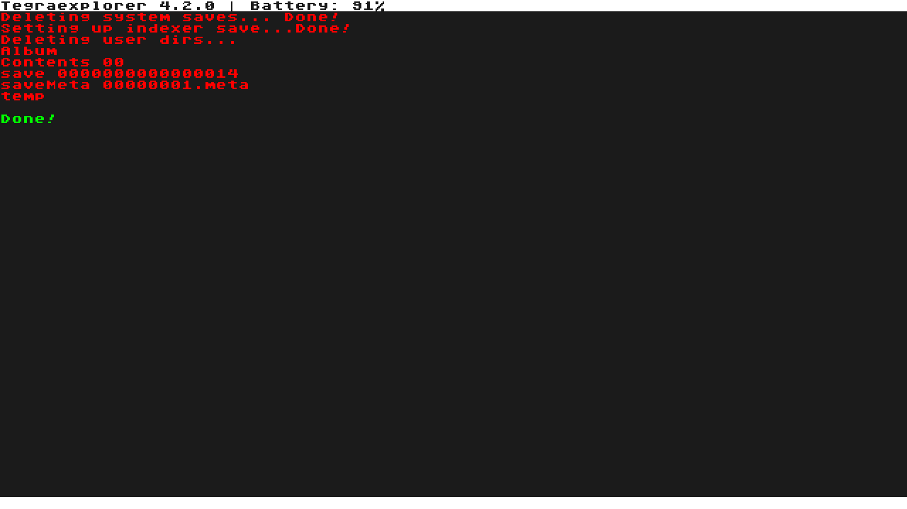

---
hide:
  - navigation
---
# Очистка Сиснанда от следов пиратства
!!! note "Консоль в бане"
    Если ваша консоль уже в бане, то данный гайд не поможет её разбанить

!!! danger "Сделайте бэкапы"
    Перед выполнением этого гайда рекомендуется сделать бэкап Сиснанда и ключей. Если у вас что-то пойдёт не так, то вы сможете восстановить систему.

## Подготовка
1. Сделайте дамп [ключей](../ultra_wiki/backup_emuMMC.md/#_3), если он ещё не создан
2. [Обновите Ultra-NX](../ultra_wiki/installing_update.md/#_3) до последней версии

## Очистка Сиснанда
1. Выключите вашу консоль и зайдите в hekate(кнопка уменьшения громкости при включении консоли, если консоль с чипом)

2. Перейдите во вкладку **Payloads**

3. Выберите **TegraExplorer.bin**

4. Консоль загрузится в Tegra Explorer. Управление в нём осуществляется с помощью кнопок громкости и кнопки питания.
5. Нажмите кнопку питания

6. Перейдите в пункт **SystemWipe.te**

7. Выберите **Wipe sysmmc**

8. Подождите 5 секунд и нажмите кнопку питания

9. Когда появится зелёная надпись, нажмите кнопку питания

10. Перейдите в пункт **Reboot to bootloader/update.bin**

11. Зайдите в Hekate

12. Перейдите в More Configs

13. Выберите Full Stock

!!! note "Создание эмунанда"
    После очистки Сиснанда настоятельно рекомендуется [создать эмунанд](../ultra_wiki/backup_emuMMC.md/#emunand), иначе устанавливая пиратские игры на Сиснанд вы его опять загрязните. Даже если оказалось, что консоль уже в бане, Эмунанад не будет лишним. Эмунанд — это песочница, которую очень просто пересоздать, если она повредится, в отличие от Сиснанда.