---
hide:
  - navigation
---
# Решение проблем с подключением Wi-Fi

## Описание проблемы
Иногда Nintendo Switch не может подключиться к Wi-Fi или не видит сеть. Часто это связано с региональными ограничениями — например, когда роутер использует частоты 5 GHz, недоступные в Wi-Fi регионе консоли.

### **Первый способ**
Данный способ подойдёт вам, если вы просто хотите, чтобы консоль нормально подключалась к вашему Wi-Fi.

1. Перейдите в панель управления роутером
2. Найдите настройку канала Wi-Fi для 5Ghz
3. Смените канал например на 36-64(доступны во всех регионах, но могут быть сильно загружены) или на 100-140(доступны практически во всех регионах, зачастую менее загружены)

### **Второй способ**
Данный способ более универсальный, но труднее в реализации, в нём вы смените Wi-Fi регион на Америку, где доступны все каналы. После данных манипуляций ваша консоль сможет подключаться к любой Wi-Fi сети, в независимости от канала.

!!! note "Примечание"
    Сменить регион можно в Сиснанде и Эмунанде. В гайде ниже будет представлено изменение региона на Сиснанде, если вы хотите сделать это на Эмунанде, то действия будут идентичны, только вместо eMMC будет emuMMC. Рекомендуется сменить регион в Сиснанде и Эмунанде. Данные действия безопасны с точки зрения бана.

1. Сделайте дамп [ключей](../ultra_wiki/backup_emuMMC.md#bekap-kliuchei) и скопируйте prod.keys на ПК
2. Скачайте на компьютер [NxNandManager](res/wifi_problem/NxNandManager_5.2.1_x64.zip) и [NX WiFi Region Changer](https://github.com/sthetix/NX-Wifi-Region-Changer/releases/download/1.0.1/NxWifiChanger-1.0.1.exe)
3. Откройте NxNandManager и выберите **Сonfigure keyset**

    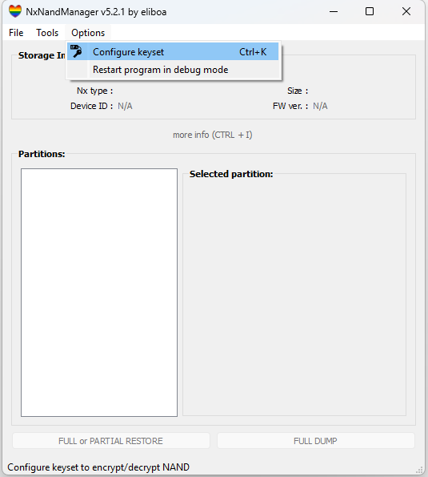

4. Импортируете ключи в NxNandManager и нажмите кнопку **Save**

    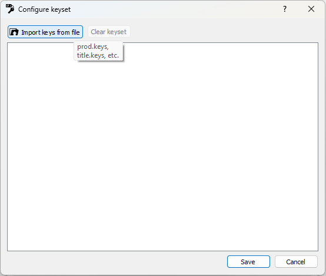

5. Откройте Hekate, перейдите в **Tools - USB Tools** и отключите **Read-Only**

    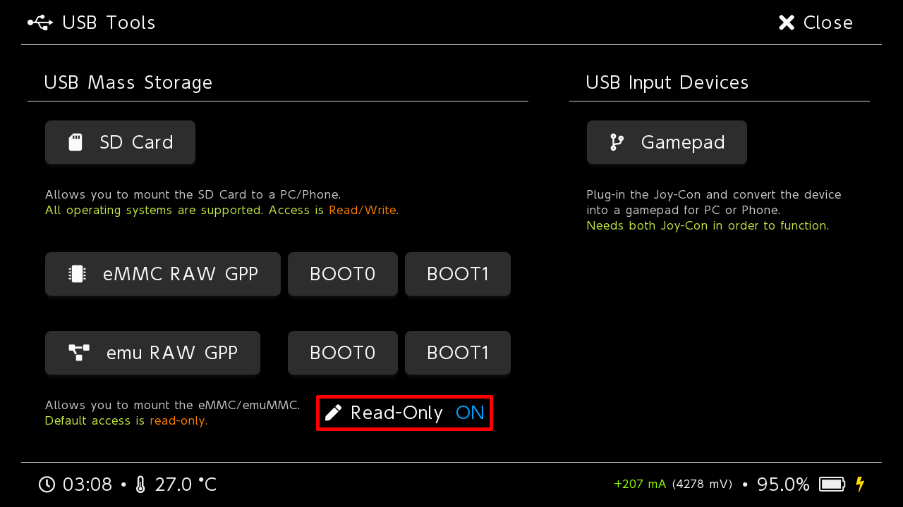

6. Выберите **eMMC RAW GPP**(**emu RAW GPP** для Эмунанда)

    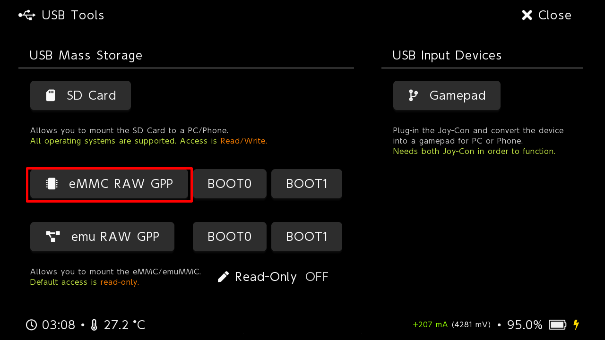

7. Перейдите в **File - Open drive**

    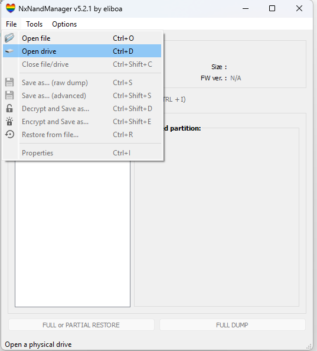

8. Выберите **eMMC GPP Hekate**(в случае если вы это делаете на Эмунанде, то **SD GPP Hekate**)

    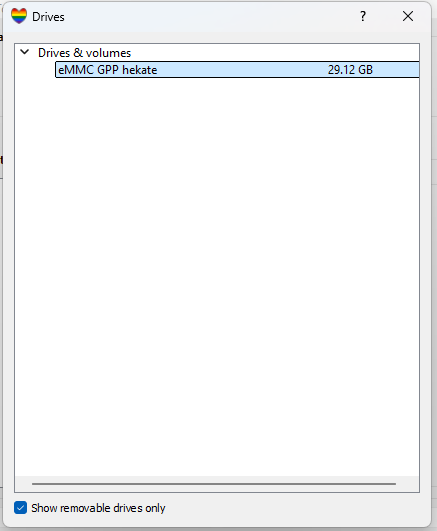

9. Расшифруйте PRODINFO и сделайте его дамп с помощью кнопки **Decrypt & dump to file...**

    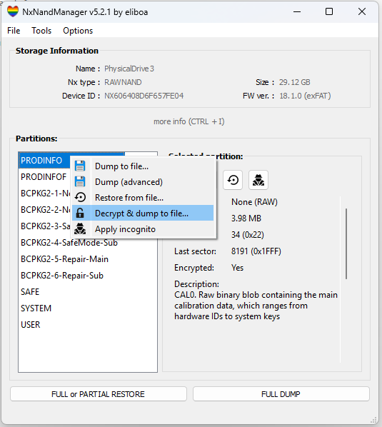

10. Откройте NX Wi-Fi Region Changer и выберите файл вашего PRODINFO, потом измените страну на "America" и нажмите на кнопку "Update Region". После этого файл, что мы дампили в прошлом шаге обновится.

    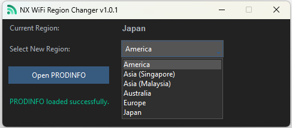

11. Перейдите в NxNandManager и выберите файл вашего PRODINFO

    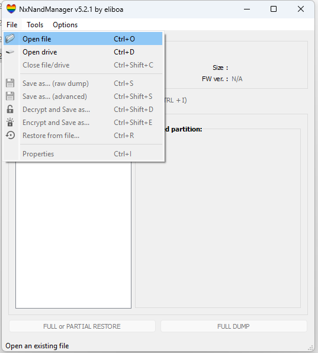

12. Зашифруйте ваш PRODINFO и сохраните его с помощью кнопки **Encrypt & dump to file...**

    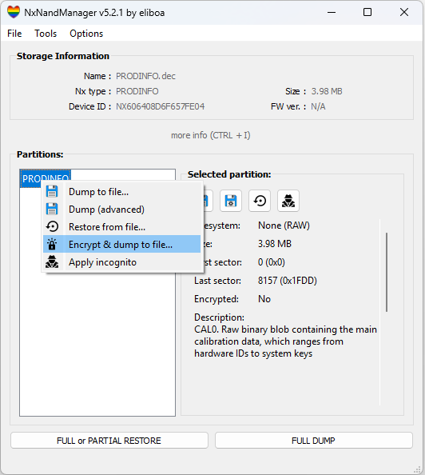

13. Повторите 7-8 шаг
14. Замените PRODINFO на изменённый, выбрав файл, который получился у вас в 12 шаге с помощью кнопки **Restore from file...**

    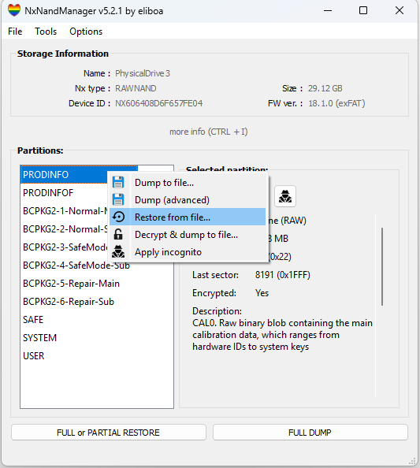

15. Закройте NxNandManager и безопасно извлеките консоль. Если это не получается сделать привычным методом, то откройте "Устройства и принтер", найдите ваше устройство и удалите его.

    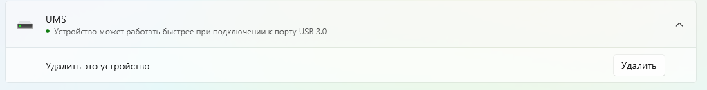

!!! note "WPA3"
    Nintendo Switch не поддерживает WPA3, из-за чего консоль может не подключатся к вашей сети или не обнаружит её. В этом случае поставьте протокол защиты на WPA2 и WPA3(чтобы устройства, у которых есть возможность подключались через WPA3, а остальные через WPA2).